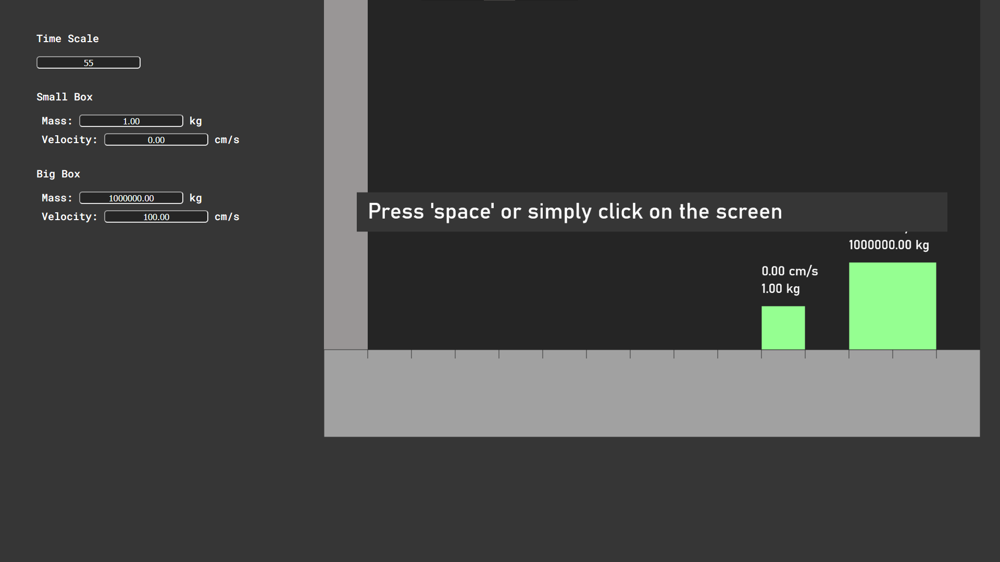
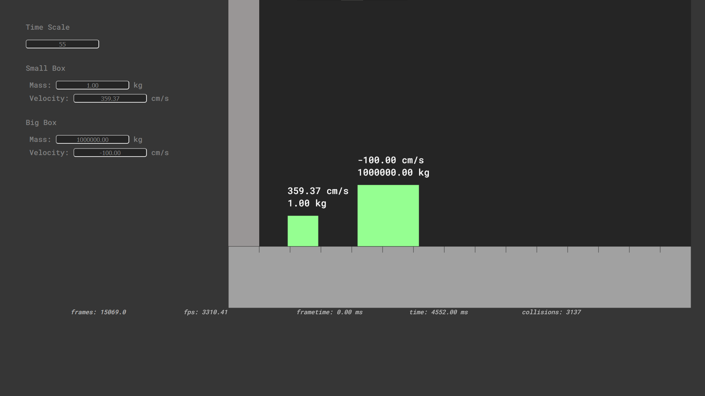

# Playing Pool With π

Hosted on [GitHub Pages](https://viggostrom.github.io/Pool-With-PI/).

## Description
This project was inspired by a [video by 3Blue1Brown](https://youtu.be/HEfHFsfGXjs?si=_SICNW7UBhmvzl9v) that highlights a [paper by Gregory Galperin](https://www.maths.tcd.ie/~lebed/Galperin.%20Playing%20pool%20with%20pi.pdf). I made this project as a part of the *programming 1* course at NTI Gymnasiet Uppsala.

## Technologies
- HTML
- CSS
- JavaScript
- HTML Canvas